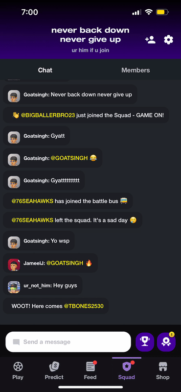
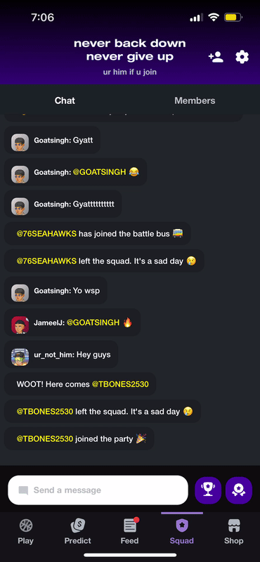

# Stadium Live Demo: My work for the past 8 months:

If you want to check out the app -> https://www.stadiumverse.com/

Stadium Live is a rising betting / fantasy mobile app with around 80k daily active user and 250K total downloads. With an engineering team of 8,
I hit the ground running and shipped multiple complex, end-to-end features. Below are 4 of the most note-worthy ones.

## Project #1: User Profile Revamp📱

### Summary
The old profile has not been touched up since a year ago -- ancient history for a startup. The goal of the revamp is to give it a more slick and themeatic design along with 3 objectives in mind
  - Increase in Virality (Share rate)
  - Set up as main entry point for the upcoming monitization expansion
  - Allow users for a more personalized skill expression (favourites, collectibles, win rates, etc)

New Profile             |  Old Profile
:-------------------------:|:-------------------------:
  |  

### Features
- Refractored old profile queries using graphql batching and caching for speedy performance gains

  <table style="width: 100%">
    <tr>
        <th style="width: 33%; text-align: center;">Animated scrolling/loading components</th>
        <th style="width: 33%; text-align: center;">Faves editing and player profiles</th>
        <th style="width: 33%; text-align: center;">Badges collection</th>
    </tr>
    <tr>
        <td ></td>
        <td ></td>
        <td ></td>
    </tr>
    <tr>
        <th style="width: 33%; text-align: center;">Paginated collectibles list & animated slider</th>
        <th style="width: 33%; text-align: center;">Paginated friends profiles</th>
        <th style="width: 33%; text-align: center;">Avatar items list view with output preview</th>
    </tr>
    <tr>
        <td style=></td>
        <td style=></td>
        <td style=></td>
    </tr>
  </table>

### Challenges and Learnings
- Lots of net new components to build out. Volumn wise easily the beefiest front-end feature I'd had to build
- Animation is fun but hard. Lots of sleep lost on timing the animation parts (username scollY, profile pic shrink, background blur) in sync with each other so that it all looks like a single
seamless scroll
- Definitly a challenge trying to make React animation work properly on both IOS and Android

## Project #2: Personalized Stakes 💸

### Summary
One of the biggest pivots we took in 2023 is the addition of compeititve sports betting, which internally we called Stakes. I built a hefty recommendation algorithm to display 6 of the most relevant stakes to an user's feed page at any point during the day. 
Algorith consists of...
- Personalized scoring system using users' favourites and match joins history to find explicit and implicit relevant players, teams, and leagues
- Rank and order avaiable Moneyline/Player Props stakes based on relevance score system. 
- Additional scoring factors such as league variety, start time decay function, and player popularity
- A degree of seed randomaization to ensure uniqueness of each user's stakes of for the day

### Demo

### Challenges and Learnings
- Really stretched my SQL knowledge. Delved into tons of Postgres docs to achieve some of the behaviours mentioned above
- Many timezone-based edge cases to consider such as answered stakes, pending stakes, missed stakes, and pushed stakes (delayed)
- Learned and applied advanced SQL tools such as Postgres performance indexes and nested window functions
- Quite hard to generalize a one-hat-fit-all experience for our broad user base -- even Product wasn't quite sure. Took some iterations to finally land on this score-based approach. 
- My last project during my internship so wrote many detailed documentaions for handoff. 

## Project #3: Squad 2.0 🎮

### Summaries
Major expension on our clan-like multiplayer mode Squad

### Features

  <table style="width: 100%">
    <tr>
        <th style="width: 33%; text-align: center;">Inter/Intra Squad leaderboard</th>
        <th style="width: 33%; text-align: center;">Squad weekly challenges and rewards</th>
    </tr>
    <tr>
        <td ></td>
        <td ></td>
    </tr>
    <tr>
        <th style="width: 33%; text-align: center;">Paginated squad chats with profiles</th>
        <th style="width: 33%; text-align: center;">Skill based squads matching & animated squad card</th>
    </tr>
    <tr>
        <td style=></td>
        <td style=></td>
    </tr>
  </table>

### Challenges and Learnings
- This was my first major project after ramp up. Took some stumbles but learned many interesting things like end-to-end deployment methods and back wards compatability
- First time working with real time data as we use firebase pub/sub for our chat, quite a powerful tool
- Handling squad join/leave end-to-end flow could be tricky at times. Learned a lot about thinking in different perspectives in terms of clients vs server

## Project #4: Player Mentions 🏀
### Summaries
### Features
### Challenges and Learnings
- 

