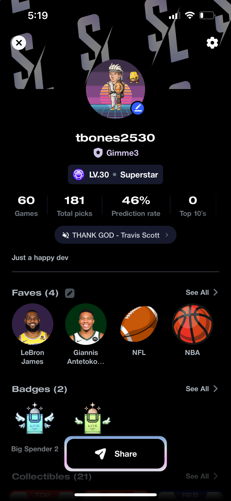
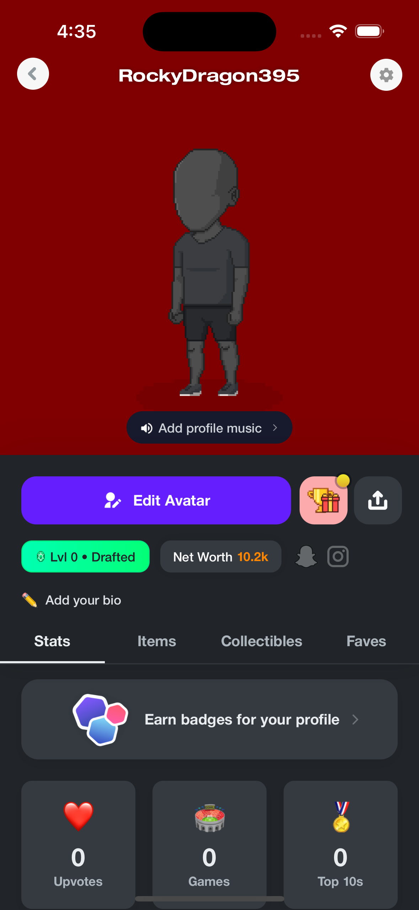
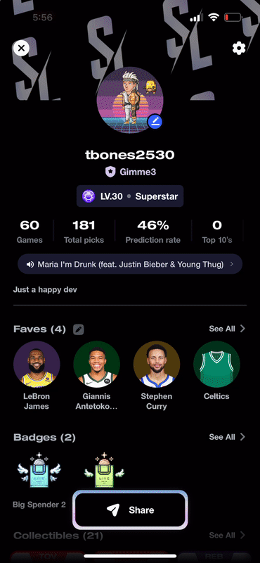
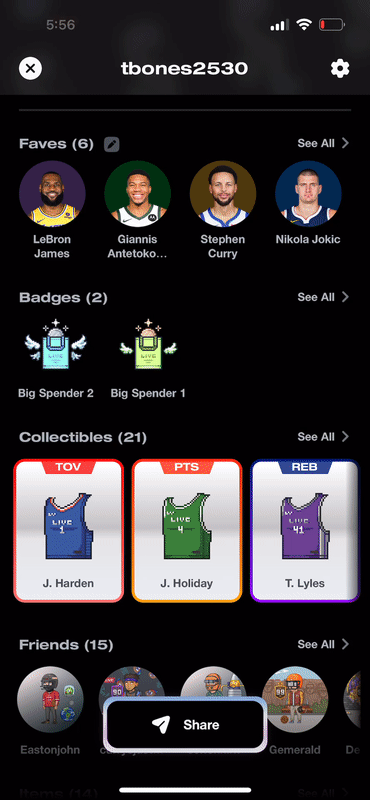

# Stadium Live Demo: My work for the past 8 months:

If you want to check out the app -> https://www.stadiumverse.com/

Stadium Live is a rising betting / fantasy mobile app with around 80k daily active user and 250K total downloads. With an engineering team of 8,
I hit the ground running and shipped multiple complex, end-to-end features. Below are 4 most note-worthy ones.

## Feature#1: User Profile Revamp📱

### Summary
The old profile has not been touched up since a year ago -- ancient history for a startup. The goal of the revamp is to give it a more slick and themeatic design along with 3 objectives in mind
  - Increase in Virality (Share rate)
  - Set up as main entry point for the upcoming monitization expansion
  - Allow users for a more personalized skill expression (favourites, win rates, etc)

New Profile             |  Old Profile
:-------------------------:|:-------------------------:
  |  

### Features
- Refractored old profile queries using graphql batching and caching for speedy performance gains

| Smooth, animated scrolling/loading components inspired by Twitter profiles | Faves editing and player profiles |
| --- | --- |
|  |  |
| Badges collection | Paginated collectibles scroll view and animated slider |
|  |  |
| Paginated friends profiles | Avatar items list view with output preview |
|  |  |